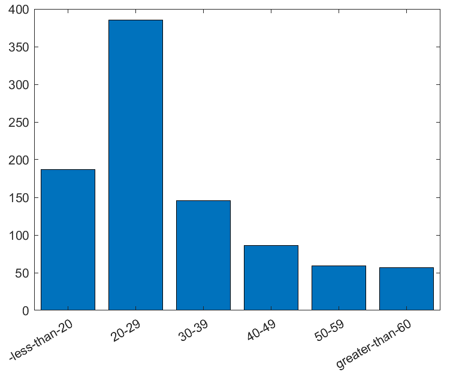

## Introduction
Various forms of iris databases had been published that address some specific research problems and are made available to the biometrics research community such as: constraint databases; mobile iris; multispectral; synthetics; iris at a distance; contact lenses; liveness detection; Aging, etc. However, even though these databases have addressed many of the problems mentioned above, most of them contain subjects of primarily Caucasian and Asian docents with very few Africans and many times zero Africans. It is particularly challenging as this has created a research blind spot for African cohorts in these databases. Despite many of the reported investigative studies on racial bias in face biometrics, very few iris racial bias-related studies have been published, which can be due to the insufficient number of other races databases such as the Africans. Recently, face recognition algorithms have been reported to be biased toward specific demographics. Most prominently, many investigative studies have reported higher false-positive rates in African subject cohorts than in other cohorts. Due to the unavailability of the required quantity of African cohorts in the publicly available iris databases, similar studies would be difficult to replicate on iris biometrics. We presents a mainly African dataset that can be useful in addressing some of these challenges.

## Description
The iris images were captured in Nigeria, Africa. The capturing exercise was conducted across various locations in multiple sessions over three months. Due to logistical constraints, the capturing exercise was limited to the northern part of Nigeria. Each subject volunteer was asked to sign a consent form authorizing the data to be used for only research purposes. The iris sensor device for capturing the images is the IKUSBE30 iris sensor from IrisKing. The setup for the capturing exercise is shown in Fig. 1. Each volunteer was asked to hold the device, standing or sitting, based on their preference. As such, the iris images were captured at various degrees of head postures.

")
Fig. 1: Iris Capturing set-ups (indoor and outdoor)

The procedure for image capturing is in two steps:
  - 1. Step 1: Straight Gaze Capture: In this step, the volunteer was asked to hold the sensor and gaze into its lenses while moving the eyes in small ranges to the left, right, up, or down for approximately 3 minutes. During this time, images were periodically captured automatically at constant intervals. The eye movement ensures that the iris position and orientation are highly diversified across the captured images. Samples of the captured images in this step are shown in Fig. 2 (left).
  - 2. Step 2: Open-Close Capture:  In this step, the volunteer was asked to open and close the eyes while gazing into the device for approximately 3 minutes. The iris images were automatically captured within this period. The essence of the opening and closing of the eyes is to ensure that the images contain irises of various sizes and degrees of occlusion, from fully closed eyes to half open and fully open eyes. This procedure will ultimately improve image diversity. Exemplary samples are shown in Fig. 2 (right).

 and Step 2 (right image)")
Fig. 2: Exemplary samples of captured images in Step 1 (left image) and Step 2 (right image)

After the capturing sessions, the stored images were processed. The processing steps comprise automatic image selection to discard images with duplicate content, followed by manual image selection that guarantees the selected images' reliability. In the automatic selection, all the images from a single eye of one subject were organized into a matrix, with each column representing an image. The images of the subject's eyes were then processed, and duplicates were removed using this procedure. The remaining images were then manually processed. The manual selection involves one-by-one human inspection of each image to identify damaged images and those images with no irises captured in them. Some sample images of one subject from the generated dataset are shown in Fig. 3, the labelled sampled images in Fig. 4, the summary of the database is presented in Table 1 and the database subjects' age distribution is shown in Fig. 5.

 and (b) right iris (lower two rows)")
Fig. 3: Samples of one subject left iris (upper two rows) and (b) right iris (lower two rows)

 left iris (upper two rows) and (b) right iris (lower two rows)")
Fig. 4: Labelled iris mask, inner and outer circle superimposed on respective samples in Fig. 3 for (a) left iris (upper two rows) and (b) right iris (lower two rows)

Tab. 1: Summary of the generated database

Fig. 5: Age distribution of the generated database

## Database Organization
The database package comprises of the following components organised in multiple directories:

  - image folder: This contain the iris images. Each image is named with SubjectID_Eye_ImageNumber.jpg. That represents:
    - SubjectID: a unique number for each subject
    - Eye is a letter that can be either “L” for left eye or “R” for right eye
    - ImageNumber is a sequential number for images for the same subject
  - iris_edge folder: This contain the corresponding 1-pixel iris edge binary images 
  - iris_edge_mask folder: This contain the corresponding iris binary masks of the images 
  - pupil_edge folder: This contain the corresponding 1-pixel pupil edge binary images 
  - pupil_edge_mask folder: This contain the corresponding pupil binary masks of the images 
  - params folder: This contain the corresponding ini files that describes radius and orientation both the iris and pupil used in the generation of iris edge, iris mask, pupil edge, pupil and mask images 
  - Protocols folder: This contain the files named with each of the defined proposed protocols. Each of the files contains list of all the images allowed to be used for that protocol which are categorised as either Training, Testing, Target or Query as described in the database paper.
  - Codes folder: These are evaluation codes in multiple programming languages that can be used to easily adopt the database for various applications.

## Copyright and Contacts

The database is released for research and educational purposes. We hold no liability for any undesirable consequences of using the database. All rights of the CASIA database are reserved. Any person or organization is not permitted to distribute, publish, copy, or disseminate this database. In all documents and papers that report experimental results based on this database, our efforts in constructing the database should be acknowledged such as “Portions of the research in this paper use the CASIA-Iris-Africa collected by the Chinese Academy of Sciences’ Institute of Automation (CASIA)” and a reference to “CASIA-Iris-Africa Image Database, [http://biometrics.idealtest.org/](http://biometrics.idealtest.org/)” should be included. 