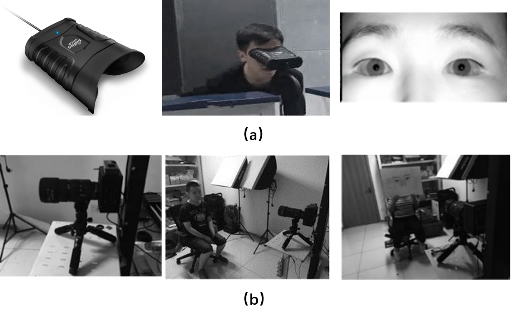
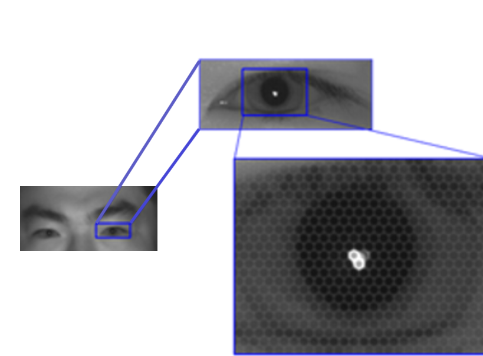

## Introduction

The dataset for iris liveness detection based on light field (LF) imaging was collected by [1], wherein the first author is one of our collaborators. We have got the authority from the authors of [1] and released the LF focal stack data. 
## Setup of dataset collection

The dataset was captured using a [lab-produced microlens based LF camera](http://cripac.ia.ac.cn/CN/column/item105.shtml) and a commercial device [IKUSB-E30](http://www.irisking.com/pron.php?id=523) under near-infrared (NIR) illumination. The setup of dataset collection was shown in Fig.1.

Fig. 1: Setup of dataset collection

The types of presentation attacks include printed papers, printed glossy photos, and electronic displays. The high-quality iris samples were first captured by IKUSB-E30, and then these high-quality samples were printed on papers and photos, or displayed on the screen of iPad mini 4 to generate the artefacts. The main lens of the lab-produced LF camera was tuned to be in focus at a position of 1.6 meters. Simultaneously, both bona fide and presentation attack iris samples were captured when the subjects and PAIs were standing at or be placed at three distances, i.e. 1.5 meters, 1.6 meters, 1.7 meters.

## Statistics of the Dataset

The dataset contains 504 samples from 14 subjects, consisting of 230 LF images of bona fide iris and 274 LF images of spoofing iris. The respective sample number of the PAIs, i.e. printed papers, printed photos, and electronic display are 18, 122, 134.

An example of raw LF image containing both eyes printed on photos is shown in Fig.2. Hexagonal microlens images can be observed from the close-up of iris in the raw LF image. 

Fig.2: An example of raw LF image containing both eyes printed on photos. Hexagonal microlens images can be observed from the close-up of iris in the raw LF image.

The LF toolbox released by [2] was utilized to decode raw LF images into 4D LF data. The eye regions were cropped from the same location of each sub-aperture image (SAI). The spatial resolution of each SAI after cropping is $128 \times 96$, and the angular resolution is $7 \times 7$. Examples from the same subject's right eye in the dataset are shown in Fig.3.

 Bona fide iris sample. (b) A4 paper printed iris sample. (c) Glossy photo printed iris sample. (d) Electronically displayed iris sample.")
Fig. 3: Examples from the same subject's right eye in the dataset. (a) Bona fide iris sample. (b) A4 paper printed iris sample. (c) Glossy photo printed iris sample. (d) Electronically displayed iris sample.

The rendered focal stack via digital refocusing has 145 slices around the best focus plane. 

The details of the adopted database is listed in Table 1.

## Copyright and Contacts

The database is released for research and educational purposes. We hold no liability for any undesirable consequences of using the database. All rights of the  database are reserved.

To receive a copy of the database, you can apply for it on our [BIT website](http://www.idealtest.org/#/datasetDetail/25)

## Reference
>[1] 宋平, 黄玲, 王云龙, 刘菲, 孙哲南. 基于计算光场成像的虹膜活体检测方法. 自动化学报, 2019, 45(9): 1701-1712. (Ping Song, Huang Ling, Wang Yunlong, Liu Fei, and Sun Zhenan. Iris liveness detection based on light field imaging. ACTA AUTOMATICA SINICA, 45(9):1701–1712, 2019.)

>[2] Donald G Dansereau, Oscar Pizarro, and Stefan B Williams, “Decoding, calibration and rectification for lenselet-based plenoptic cameras,” in Computer Vision and Pattern Recognition (CVPR), 2013, pp. 1027–1034.