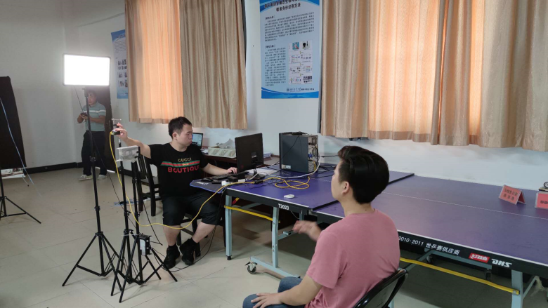

## Introduction

CASIA-Polar is a face anti-spoofing dataset based on polarization imaging, which takes advantage of polarization information in material classification to enable robust face anti-spoofing research.
## Setup of dataset collection

The hardware system used to collect this dataset is shown in Fig.1, consists of a Lucid Phoenix PHX050S-P polarized camera equipped with Sony’s polarization sensor and a Mindvision MVGE501GC-T RGB camera. 

Types of spoofing attacks include printed paper, printed glossy photographs, electronic displays, silicone masks, rubber masks, and customized silicone prosthetic heads. High-quality face samples are first captured by the MVGE501GC-T RGB camera and these high-quality samples are then printed on paper and photographs or displayed on a computer screen to produce artifacts. At the same time, both genuine and spoofing attack face samples were captured when the subjects and presentation attack were standing at or be placed at six distances, i.e. 1m, 1.5m, 2m, 3m, 4m, and 5m.

Fig. 1: Setup of dataset collection

The types of presentation attacks include printed papers, printed glossy photos, and electronic displays. The high-quality iris samples were first captured by IKUSB-E30, and then these high-quality samples were printed on papers and photos, or displayed on the screen of iPad mini 4 to generate the artefacts. The main lens of the lab-produced LF camera was tuned to be in focus at a position of 1.6 meters. Simultaneously, both bona fide and presentation attack iris samples were captured when the subjects and PAIs were standing at or be placed at three distances, i.e. 1.5 meters, 1.6 meters, 1.7 meters.

## Statistics of the Dataset

The dataset includes 22,174 samples from 121 subjects. All subjects had visible light and polarized images taken. The genuine face has 14,698 samples, while the spoofing attack has about 7,476 samples.

Figure 2 shows an example of the face images collected in the dataset, with the first row being the visible image and the second row is the corresponding DoLP image.

Fig.2: The attacks present in CASIA-Polar

## Copyright and Contacts

The database is released for research and educational purposes. We hold no liability for any undesirable consequences of using the database. All rights of the database are reserved.

E-mail: sir@cripac.ia.ac.cn
