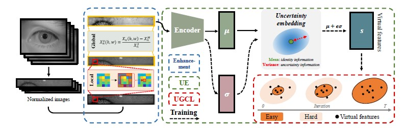

## Towards More Discriminative and Robust Iris Recognition by Learning Uncertain Factors

> Jianze Wei, Huaibo Huang, Yunlong Wang, Ran He and Zhenan Sun, "Towards More Discriminative and Robust Iris Recognition by Learning Uncertain Factors," in IEEE Transactions on Information Forensics and Security, doi: 10.1109/TIFS.2022.3154240.

The uncontrollable acquisition process limits the performance of iris recognition. In the acquisition process, various inevitable factors, including eyes, devices, and environment, hinder the iris recognition system from learning a discriminative identity representation. This leads to severe performance degradation. In this paper, we explore uncertain acquisition factors and propose uncertainty embedding (UE) and uncertainty-guided curriculum learning (UGCL) to mitigate the influence of acquisition factors. UE represents an iris image using a probabilistic distribution rather than a deterministic point (binary template or feature vector) that is widely adopted in iris recognition methods. Specifically, UE learns identity and uncertainty features from the input image, and encodes them as two independent components of the distribution, mean and variance. Based on this representation, an input image can be regarded as an instantiated feature sampled from the UE, and we can also generate various virtual features through sampling. UGCL is constructed by imitating the progressive learning process of newborns. Particularly, it selects virtual features to train the model in an easy-to-hard order at different training stages according to their uncertainty. In addition, an instance-level enhancement method is developed by utilizing local and global statistics to mitigate the data uncertainty from image noise and acquisition conditions in the pixel-level space. The experimental results on six benchmark iris datasets verify the effectiveness and generalization ability of the proposed method on same-sensor and cross-sensor recognition.

Github repository：[https://github.com/reborn20200813/uncertainty](https://github.com/reborn20200813/uncertainty)

---

## Multitask deep active contour-based iris segmentation for off-angle iris images

> Tianhao Lu, Caiyong Wang, Yunlong Wang, and Zhenan Sun "Multitask deep active contour-based iris segmentation for off-angle iris images," Journal of Electronic Imaging 31(4), 041211 (26 February 2022).

Iris recognition has been considered as a secure and reliable biometric technology. However, iris images are prone to off-angle or are partially occluded when captured with fewer user cooperations. As a consequence, iris recognition especially iris segmentation suffers a serious performance drop. To solve this problem, we propose a multitask deep active contour model for off-angle iris image segmentation. Specifically, the proposed approach combines the coarse and fine localization results. The coarse localization detects the approximate position of the iris area and further initializes the iris contours through a series of robust preprocessing operations. Then, iris contours are represented by 40 ordered isometric sampling polar points and thus their corresponding offset vectors are regressed via a convolutional neural network for multiple times to obtain the precise inner and outer boundaries of the iris. Next, the predicted iris boundary results are regarded as a constraint to limit the segmentation range of noise-free iris mask. Besides, an efficient channel attention module is introduced in the mask prediction to make the network focus on the valid iris region. A differentiable, fast, and efficient SoftPool operation is also used in place of traditional pooling to keep more details for more accurate pixel classification. Finally, the proposed iris segmentation approach is combined with off-the-shelf iris feature extraction models including traditional OM and deep learning-based FeatNet for iris recognition. The experimental results on two NIR datasets CASIA-Iris-off-angle, CASIA-Iris-Africa, and a VIS dataset SBVPI show that the proposed approach achieves a significant performance improvement in the segmentation and recognition for both regular and off-angle iris images.
