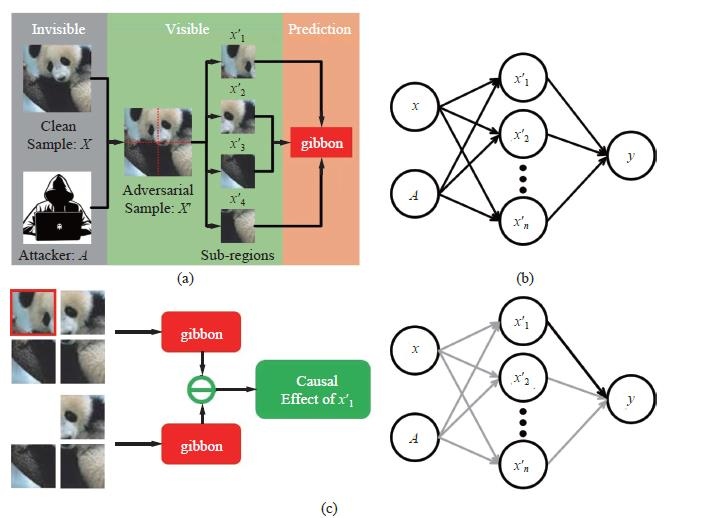
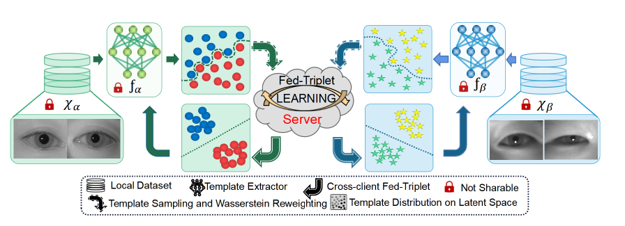

## 1. Towards Interpretable Defense Against Adversarial Attacks via Causal Inference

> Min Ren, Yunlong Wang*, Zhaofeng He. Towards interpretable defense against adversarial attacks via causal inference. Machine Intelligence Research.
> 
> <http://doi.org/10.1007/s11633-022-1330-7>

Deep learning-based models are vulnerable to adversarial attacks. Defense against adversarial attacks is essential for sensitive and safety-critical scenarios. However, deep learning methods still lack effective and efficient defense mechanisms against adversari-al attacks. Most of the existing methods are just stopgaps for specific adversarial samples. The main obstacle is that how adversarial samples fool the deep learning models is still unclear. The underlying working mechanism of adversarial samples has not been well explored, and it is the bottleneck of adversarial attack defense. In this paper, we build a causal model to interpret the generation and performance of adversarial samples. The self-attention/transformer is adopted as a powerful tool in this causal model. Compared to existing methods, causality enables us to analyze adversarial samples more naturally and intrinsically. Based on this causal model, the working mechanism of adversarial samples is revealed, and instructive analysis is provided. Then, we propose simple and effective adversarial sample detection and recognition methods according to the revealed working mechanism. The causal insights enable us to detect and recognize adversarial samples without any extra model or training. Extensive experiments are conducted to demonstrate the effectiveness of the proposed methods. Our methods outperform the state-of-the-art defense methods under various adversarial attacks.

## 2. FedIris: Towards More Accurate and Privacy-preserving Iris Recognition via Federated Template Communication

> Zhengquan Luo, Yunlong Wang*, Zilei Wang, Zhenan Sun,Tieniu Tan. IEEE/CVF Conference on Computer Vision and Pattern Recognition 2022, International Workshop on Federated Learning for Computer Vision.
> 
> <https://sites.google.com/view/fedvision/home?authuser=0>

As biometric data undergo rapidly growing privacy concerns, building large-scale datasets has become more difficult. Unfortunately, current iris databases are mostly in small scale, e.g., thousands of iris images from hundreds of identities. What's worse, the heterogeneity among decentralized iris datasets hinders the current deep learning (DL) frameworks from obtaining recognition performance with robust generalization. It motivates us to leverage the merits of federated learning (FL) to solve these problems. However, traditional FL algorithms often employ model sharing for knowledge transfer, wherein the simple averaging aggregation lacks interpretability, and divergent optimization directions of clients lead to performance degradation. To overcome this interference, we propose FedIris with solid theoretical foundations, which attempts to employ the iris template as the communication carrier and formulate federated triplet (Fed-Triplet) for knowledge transfer. Furthermore, the massive heterogeneity among iris datasets may induce negative transfer and unstable optimization. The modified Wasserstein distance is embedded into the FedTriplet loss to reweight global aggregation, which drives the clients with similar data distributions to contribute more mutually. Extensive experimental results demonstrate that the proposed FedIris outperforms SOLO training, model-sharing-based FL training, and even centralized training. 
