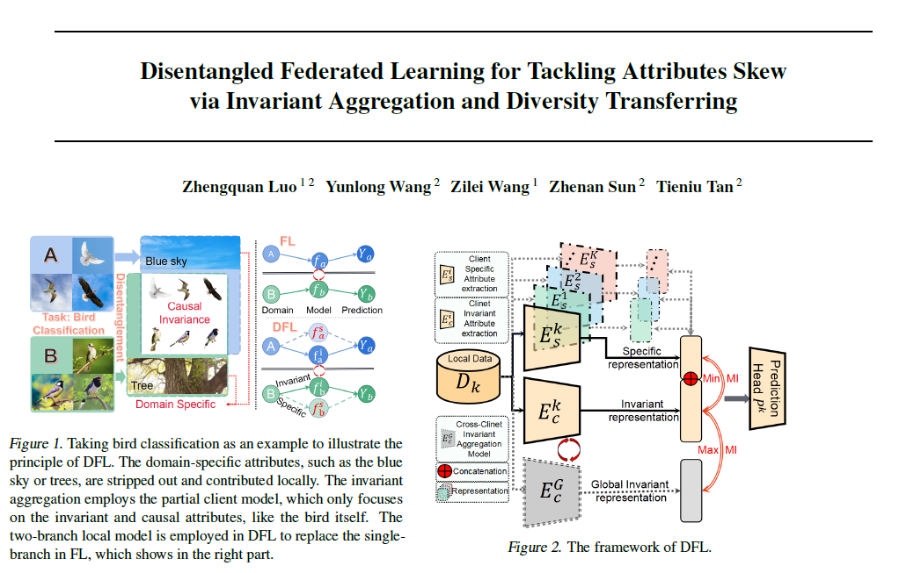

> Zhengquan Luo, Yunlong Wang*, Zilei Wang, Zhenan Sun, Tieniu Tan. Disentangled Federated Learning for Tackling Attributes Skew via Invariant Aggregation and Diversity Transferring. Thirty-ninth International Conference on Machine Learning (ICML), 2022. <https://icml.cc/Conferences/2022>

Attributes skew hinders the current federated learning (FL) frameworks from consistent optimization directions among the clients, which inevitably leads to performance reduction and unstable convergence. The core problems lie in that: 1) Domain-specific attributes, which are non-causal and only locally valid, are indeliberately mixed into global aggregation. 2) The one-stage optimizations of entangled attributes cannot simultaneously satisfy two conflicting objectives, i.e., generalization and personalization. To cope with these, we proposed disentangled federated learning (DFL) to disentangle the domain-specific and cross-invariant attributes into two complementary branches, which are trained by the proposed alternating local-global optimization independently. Importantly, convergence analysis proves that the FL system can be stably converged even if incomplete client models participate in the global aggregation, which greatly expands the application scope of FL. Extensive experiments verify that DFL facilitates FL with higher performance, better interpretability, and faster convergence rate, compared with SOTA FL methods on both manually synthesized and realistic attributes skew datasets.

[人工智能前沿讲习公众号：【源头活水】ICML 2022 | 共识表征提取和多样性传播的解构联邦学习框架](https://mp.weixin.qq.com/s/xU_Rvbofvwveekq41SCpZA)

