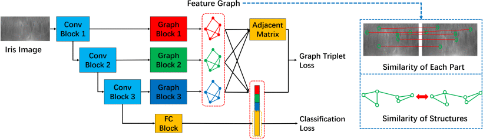

## 1. Multiscale Dynamic Graph Representation for Biometric Recognition with Occlusions

> Min Ren, Yunlong Wang, Yuhao Zhu, Kunbo Zhang, Zhenan Sun. "Multiscale Dynamic Graph Representation for Biometric Recognition with Occlusions". IEEE Transactions on Pattern Analysis and Machine Intelligence (T-PAMI) (Volume: 45)
> 
> <http://doi.org/10.1109/TPAMI.2023.3298836>

Occlusion is a common problem with biometric recognition in the wild. The generalization ability of CNNs greatly decreases due to the adverse effects of various occlusions. To this end, we propose a novel unified framework integrating the merits of both CNNs and graph models to overcome occlusion problems in biometric recognition, called multiscale dynamic graph representation (MS-DGR). More specifically, a group of deep features reflected on certain subregions is recrafted into a feature graph (FG). Each node inside the FG is deemed to characterize a specific local region of the input sample, and the edges imply the co-occurrence of non-occluded regions. By analyzing the similarities of the node representations and measuring the topological structures stored in the adjacent matrix, the proposed framework leverages dynamic graph matching to judiciously discard the nodes corresponding to the occluded parts. The multiscale strategy is further incorporated to attain more diverse nodes representing regions of various sizes. Furthermore, the proposed framework exhibits a more illustrative and reasonable inference by showing the paired nodes. Extensive experiments demonstrate the superiority of the proposed framework, which boosts the accuracy in both natural and occlusion-simulated cases by a large margin compared with that of baseline methods.

## 2. Iris-GuideNet: Guided Localisation and Segmentation Network for Unconstrained Iris Biometrics

> Jawad Muhammad, Caiyong Wang, Yunlong Wang, Kunbo Zhang, Zhenan Sun. "Iris-GuideNet: Guided Localisation and Segmentation Network for Unconstrained Iris Biometrics". IEEE Transactions on Information Forensics and Security(Volume:18).
> 
> <http://doi.org/10.1109/TIFS.2023.3268504>

In recent years, unconstrained iris biometrics has become more prevalent due to its wide range of user applications. However, it also presents numerous challenges to the Iris pre-processing task of Localization and Segmentation (ILS). Many ILS techniques have been proposed to address these challenges, among which the most effective is the CNN-based methods. Training the CNN is data-intensive, and most of the existing CNN-based ILS approaches do not incorporate iris-specific features that can reduce their data dependence, despite the limited labelled iris data in the available databases. These trained CNN models built upon these databases can be sub-optimal. Hence, this paper proposes a guided CNN-based ILS approach IrisGuideNet. IrisGuideNet involves incorporating novel iris-specific heuristics named Iris Regularization Term (IRT), deep supervision technique, and hybrid loss functions in the training pipeline, which guides the network and reduces the model data dependence. A novel Iris Infusion Module (IIM) that utilizes the geometrical relationships between the ILS outputs to refine the predicted outputs is introduced at network inference. The proposed model is trained and evaluated with various datasets. Experimental results show that IrisGuideNet has outperformed most models across all the database categories. The codes implementation of the proposed IrisGuideNet will be available at: https://github.com/mohdjawadi/IrisGuidenet.
