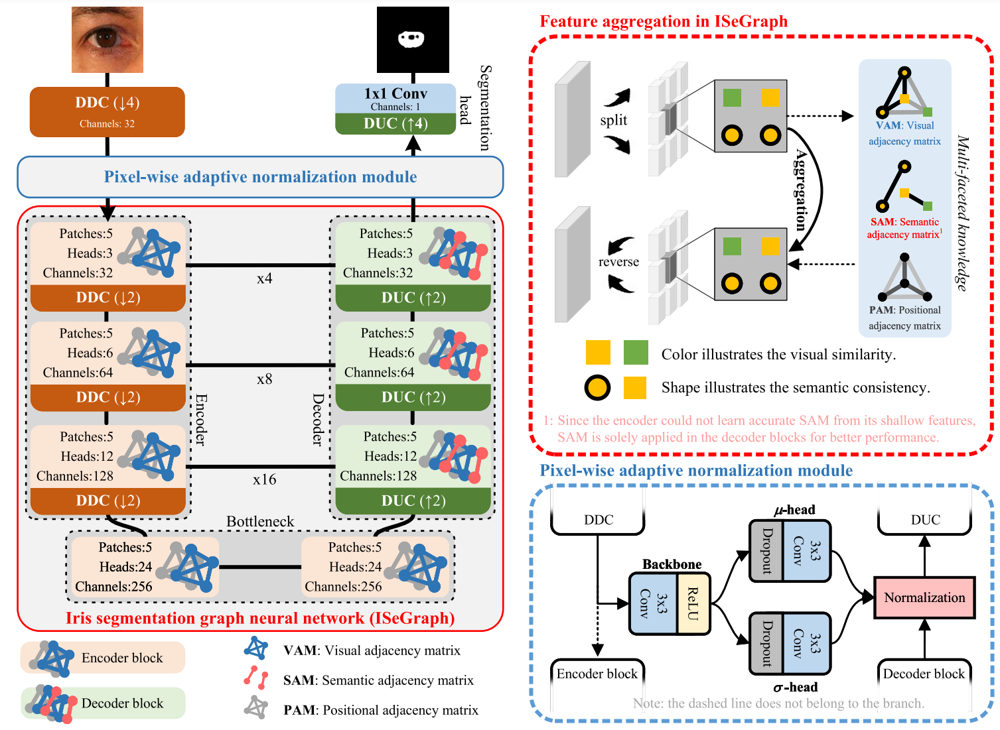

## 1. Boosting multi-modal ocular recognition via spatial feature reconstruction and unsupervised image quality estimation

> Zihui Yan, Lingxiao He, Yunlong Wang, Kunbo Zhang, Zhenan Sun, Tieniu Tan. "Boosting multi-modal ocular recognition via spatial feature reconstruction and unsupervised image quality estimation". Machine Intelligence Research (Volume: 21).
> 
> <https://doi.org/10.1007/s11633-023-1415-y>

In the daily application of an iris-recognition-at-a-distance (IAAD) system, many ocular images of low quality are acquired. As the iris part of these images is often not qualified for the recognition requirements, the more accessible periocular regions are a good complement for recognition. To further boost the performance of IAAD systems, a novel end-to-end framework for multi-modal ocular recognition is proposed. The proposed framework mainly consists of iris/periocular feature extraction and matching, unsupervised iris quality assessment, and a score-level adaptive weighted fusion strategy. First, ocular feature reconstruction (OFR) is proposed to sparsely reconstruct each probe image by high-quality gallery images based on proper feature maps. Next, a brand new unsupervised iris quality assessment method based on random multiscale embedding robustness is proposed. Different from the existing iris quality assessment methods, the quality of an iris image is measured by its robustness in the embedding space. At last, the fusion strategy exploits the iris quality score as the fusion weight to coalesce the complementary information from the iris and periocular regions. Extensive experimental results on ocular datasets prove that the proposed method is obviously better than unimodal biometrics, and the fusion strategy can significantly improve the recognition performance.

## 2. CASIA-Iris-Africa: A Large-scale African Iris Image Database

> Jawad Muhammad, Yunlong Wang, Junxing Hu, Kunbo Zhang, Zhenan Sun. "CASIA-Iris-Africa: A Large-scale African Iris Image Database". Machine Intelligence Research (Volume: 21).
> 
> <https://doi.org/10.1007/s11633-022-1402-8>

Iris biometrics is a phenotypic biometric trait that has proven to be agnostic to human natural physiological changes. Research on iris biometrics has progressed tremendously, partly due to publicly available iris databases. Various databases have been available to researchers that address pressing iris biometric challenges such as constraint, mobile, multispectral, synthetics, long-distance, contact lenses, liveness detection, etc. However, these databases mostly contain subjects of Caucasian and Asian docents with very few Africans. Despite many investigative studies on racial bias in face biometrics, very few studies on iris biometrics have been published, mainly due to the lack of racially diverse large-scale databases containing sufficient iris samples of Africans in the public domain. Furthermore, most of these databases contain a relatively small number of subjects and labelled images. This paper proposes a large-scale African database named Chinese Academy of Sciences Institute of Automation (CASIA)-Iris-Africa that can be used as a complementary database for the iris recognition community to mediate the effect of racial biases on Africans. The database contains 28 717 images of 1 023 African subjects (2 046 iris classes) with age, gender, and ethnicity attributes that can be useful in demographically sensitive studies of Africans. Sets of specific application protocols are incorporated with the database to ensure the database’s variability and scalability. Performance results of some open-source state-of-the-art (SOTA) algorithms on the database are presented, which will serve as baseline performances. The relatively poor performances of the baseline algorithms on the proposed database despite better performance on other databases prove that racial biases exist in these iris recognition algorithms.

## 3. Multi-Faceted Knowledge-Driven Graph Neural Network for Iris Segmentation

> Jianze Wei, Yunlong Wang, Xingyu Gao, Ran He, Zhenan Sun. "Multi-Faceted Knowledge-Driven Graph Neural Network for Iris Segmentation". IEEE Transactions on Information Forensics and Security ( Volume: 19).
> 
> <https://doi.org/10.1109/TIFS.2024.3407508>

Accurate iris segmentation, especially around the iris inner and outer boundaries, is still a formidable challenge. Pixels within these areas are difficult to semantically distinguish since they have similar visual characteristics and close spatial positions. To tackle this problem, the paper proposes an iris segmentation graph neural network (ISeGraph) for accurate segmentation. ISeGraph regards individual pixels as nodes within the graph and constructs self-adaptive edges according to multi-faceted knowledge, including visual similarity, positional correlation, and semantic consistency for feature aggregation. Specifically, visual similarity strengthens the connections between nodes sharing similar visual characteristics, while positional correlation assigns weights according to the spatial distance between nodes. In contrast to the above knowledge, semantic consistency maps nodes into a semantic space and learns pseudo-labels to define relationships based on label consistency. ISeGraph leverages multi-faceted knowledge to generate self-adaptive relationships for accurate iris segmentation. Furthermore, a pixel-wise adaptive normalization module is developed to increase the feature discriminability. It takes informative features in the shallow layer as a reference to improve the segmentation features from a statistical perspective. Experimental results on three iris datasets illustrate that the proposed method achieves superior performance in iris segmentation, increasing the segmentation accuracy in areas near the iris boundaries. 
