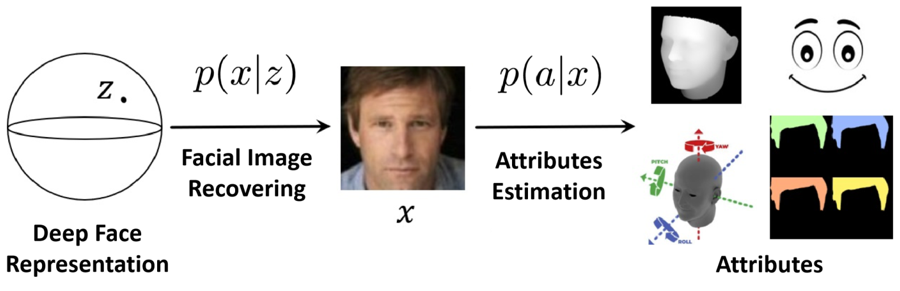

## 1. Understanding Deep Face Representation via Attribute Recovery

> Min Ren, Yuhao Zhu, Yunlong Wang, Yongzhen Huang, Zhenan Sun. Understanding Deep Face Representation via Attribute Recovery. IEEE Transactions on Information Forensics and Security ( Early Access )

> 
> <https://ieeexplore.ieee.org/document/10587012>

Deep neural networks have proven to be highly effective in the face recognition task, as they can map raw samples into a discriminative high-dimensional representation space. However, understanding this complex space proves to be challenging for human observers. In this paper, we propose a novel approach that interprets deep face recognition models via facial attributes. To achieve this, we introduce a two-stage framework that recovers attributes from the deep face representations. This framework allows us to quantitatively measure the significance of facial attributes in relation to the recognition model. Moreover, this framework enables us to generate sample-specific explanations through counterfactual methodology. These explanations are not only understandable but also quantitative. Through the proposed approach, we are able to acquire a deeper understanding of how the recognition model conceptualizes the notion of “identity” and understand the reasons behind the error decisions made by the deep models. By utilizing attributes as an interpretable interface, the proposed method marks a paradigm shift in our comprehension of deep face recognition models. It allows a complex model, obtained through gradient backpropagation, to effectively “communicate” with humans. The source code is available here, or you can visit this website: https://github.com/RenMin1991/Facial-Attribute-Recovery .
