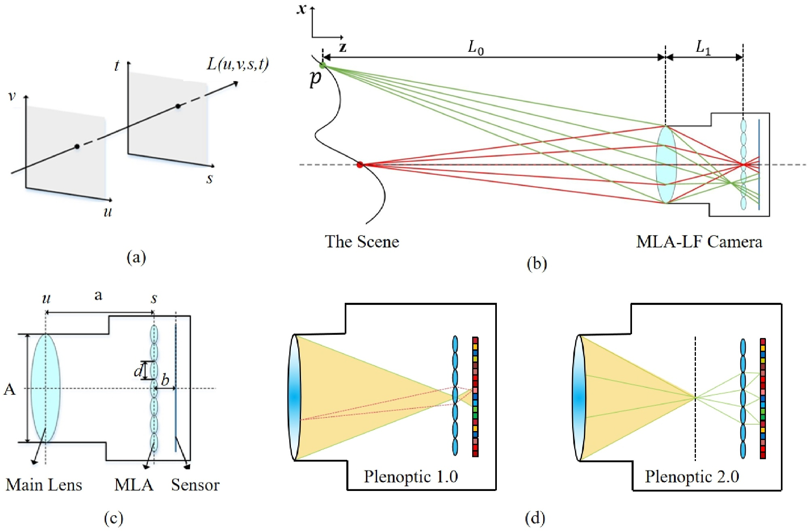

## 1. A comprehensive research on light field imaging: Theory and application

> Fei Liu, Yunlong Wang, Qing Yang, Shubo Zhou, Kunbo Zhang. A comprehensive research on light field imaging: Theory and application. IET Computer Vision

> 
> <https://doi.org/10.1049/cvi2.12321>

Computational photography is a combination of novel optical designs and processing methods to capture high‐dimensional visual information. As an emerged promising technique, light field (LF) imaging measures the lighting, reflectance, focus, geometry and viewpoint in the free space, which has been widely explored for depth estimation, view synthesis, refocus, rendering, 3D displays, microscopy and other applications in computer vision in the past decades. In this paper, the authors present a comprehensive research survey on the LF imaging theory, technology and application. Firstly, the LF imaging process based on a MicroLens Array structure is derived, that is MLA‐LF. Subsequently, the innovations of LF imaging technology are presented in terms of the imaging pro-
totype, consumer LF camera and LF displays in Virtual Reality (VR) and Augmented Reality (AR). Finally the applications and challenges of LF imaging integrating with deep learning models are analysed, which consist of depth estimation, saliency detection, semantic segmentation, de‐occlusion and defocus deblurring in recent years. It is believed that this paper will be a good reference for the future research on LF imaging technology in Artificial Intelligence era.
